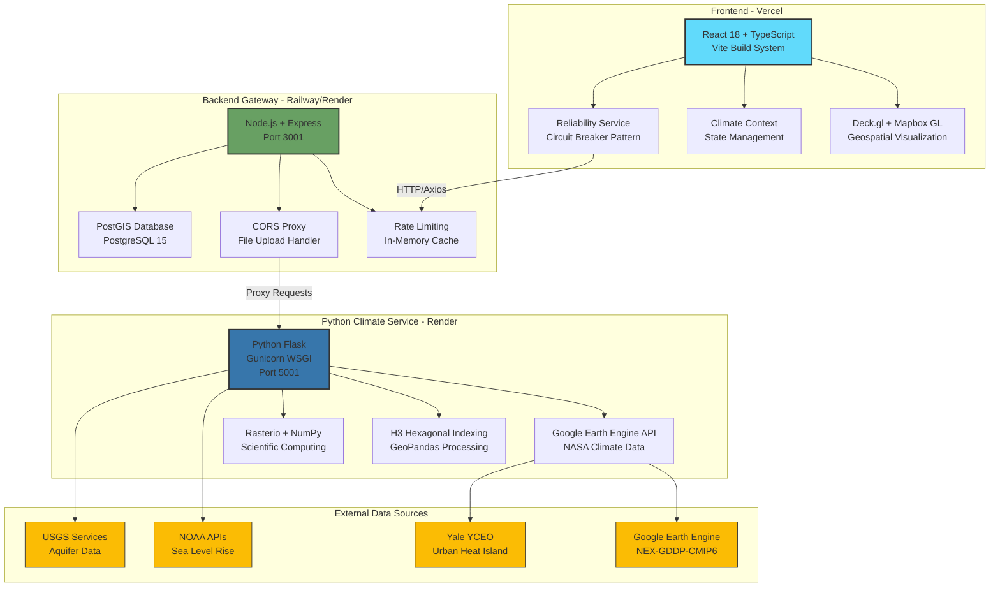
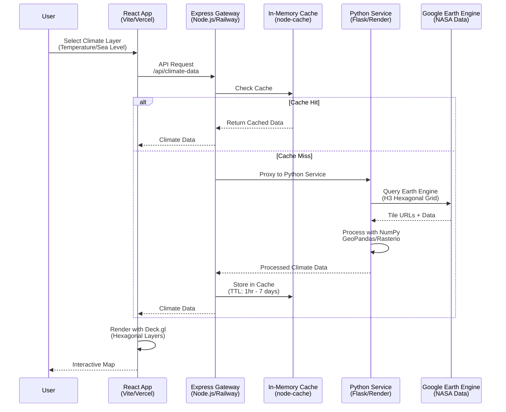
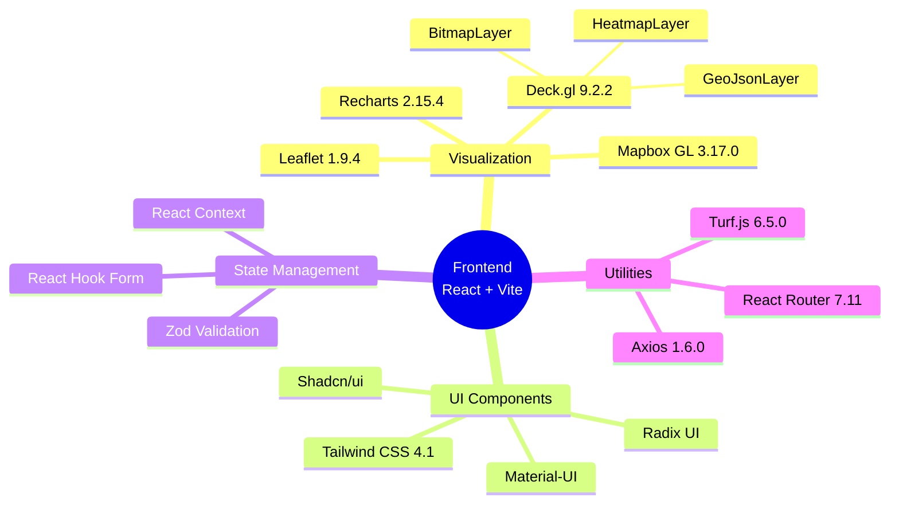
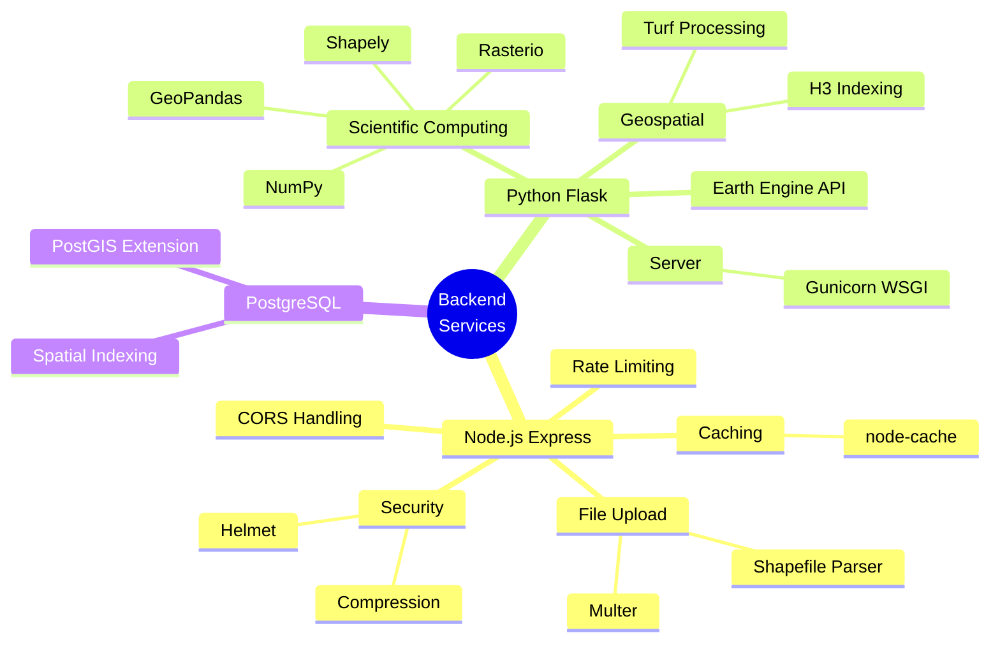
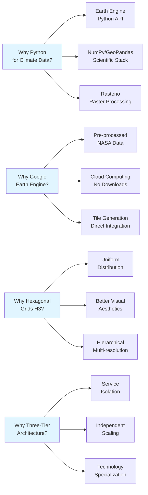
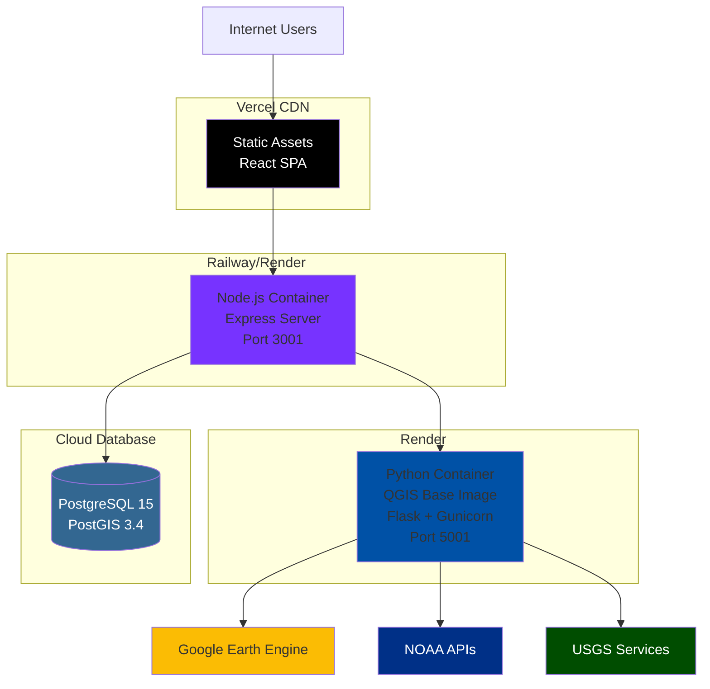
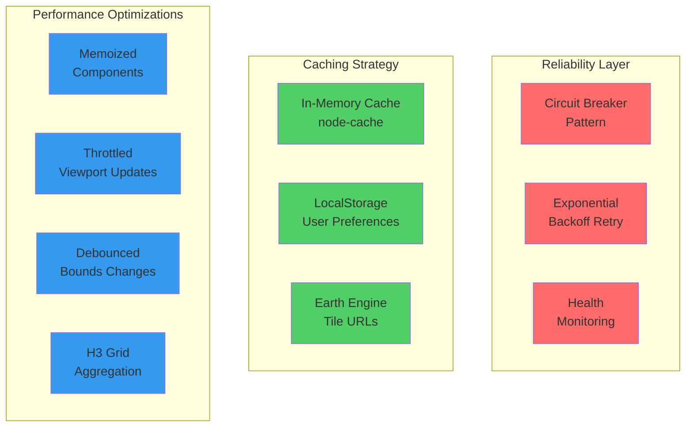
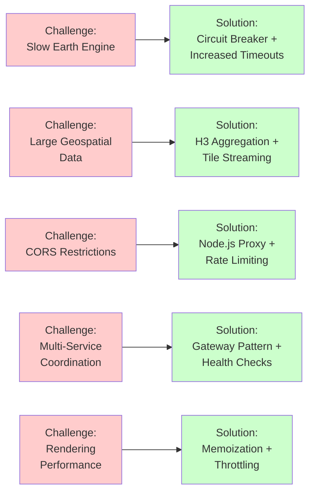

# Climate Suite Architecture & Technical Stack

## System Architecture Diagram

## Data Flow Architecture

## Technology Stack Breakdown

### Frontend Layer

### Backend Services

## Key Architectural Decisions

## Deployment Architecture

## Performance & Reliability Features

## Climate Data Layers

| Layer | Data Source | Technology | Processing |
|-------|-------------|------------|------------|
| Temperature Projection | NASA NEX-GDDP-CMIP6 | Google Earth Engine | H3 Hexagonal Grid |
| Sea Level Rise | NOAA SLR Viewer | REST API | Hexagonal Depth Values |
| Urban Heat Island | Yale YCEO UHI | Earth Engine | Raster Tiles |
| Topographic Relief | USGS SRTM 90m | Earth Engine | Hillshade Rendering |
| Precipitation/Drought | NASA Climate Data | Earth Engine | H3 Grid + Metrics |
| Water Access/Aquifers | USGS Principal Aquifers | ArcGIS REST | GeoJSON Polygons |
| Urban Expansion | Multi-year Satellite | Earth Engine | Change Detection |

## Technical Challenges Solved

---

## Why These Technology Choices?

### Python for Climate Processing
- **Earth Engine Integration**: Official Python API with mature support
- **Scientific Computing**: NumPy, GeoPandas, Shapely ecosystem
- **Raster Processing**: Rasterio for TIFF/NetCDF climate data
- **Parallel Processing**: Dask for handling large datasets
- **QGIS Integration**: Python API for advanced GIS operations

### Google Earth Engine
- **Pre-processed Data**: NASA datasets ready without downloads
- **Cloud Computing**: Server-side processing at scale
- **Direct Integration**: Tile URLs for seamless map rendering
- **400+ Datasets**: Single API for multiple climate sources

### Three-Tier Architecture
- **Service Isolation**: Independent deployment and scaling
- **Technology Specialization**: Right tool for each job
- **Fault Tolerance**: Services fail independently
- **Caching Layer**: Node.js gateway reduces Python service load

### Render for Python Service
- **QGIS Base Image**: Pre-configured geospatial environment
- **Gunicorn WSGI**: Production-ready Python server
- **Long-Running Requests**: Handles Earth Engine timeouts
- **Environment Management**: Isolated Python dependencies

### Vercel for Frontend
- **Zero Config**: Built-in SPA routing and CORS
- **Monorepo Support**: Native npm workspaces
- **Build Cache**: Fast deployments
- **CDN Distribution**: Global edge network

---

## Quick Stats

- **Languages**: TypeScript, Python, JavaScript
- **Lines of Code**: ~50,000+
- **Services**: 3 (Frontend, Gateway, Climate Processing)
- **Climate Layers**: 7 (with multiple scenarios)
- **Data Sources**: 5 (Earth Engine, NOAA, USGS, Yale, Landsat)
- **Dependencies**: 150+ npm packages, 30+ Python packages
- **Deployment Targets**: 3 (Vercel, Railway/Render, Render)
