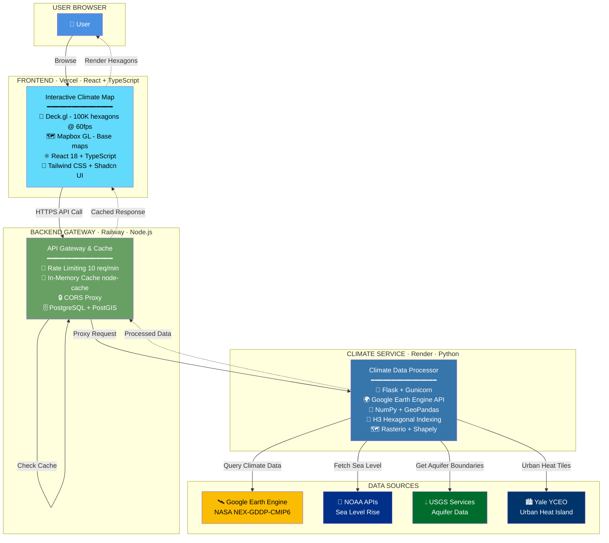

# Climate Suite - One-Page Architecture Overview

## 🌍 The Complete System (Simplified)



---

## 📊 The Stack At A Glance

| Layer | Technology | Hosting | Why This Choice? |
|-------|-----------|---------|------------------|
| **Frontend** | React 18 + TypeScript<br/>Deck.gl + Mapbox GL<br/>Vite + Tailwind CSS | **Vercel** | • Zero-config SPA routing<br/>• Built-in CDN<br/>• Fast builds with cache |
| **Gateway** | Node.js + Express<br/>PostgreSQL + PostGIS<br/>node-cache | **Railway** | • Fast I/O for routing<br/>• Rate limiting<br/>• CORS proxy |
| **Climate** | Python + Flask<br/>Earth Engine API<br/>NumPy + GeoPandas | **Render** | • Custom Docker (QGIS)<br/>• Long timeouts (30-60s)<br/>• Python-optimized |

---

## 🔑 Key Technical Decisions

### Decision 1: Why Python Instead of JavaScript?

```
JAVASCRIPT (What we DIDN'T use for climate processing)
❌ Earth Engine API: Limited features, 3 years behind Python
❌ Array Processing: Manual loops, slow for 1M+ data points
❌ GIS Tools: Turf.js is good, but lacks advanced operations
❌ Climate Formats: No NetCDF4, h5netcdf, Xarray support

PYTHON (What we USED)
✅ Earth Engine API: Official, mature, full-featured
✅ Array Processing: NumPy vectorized ops = 100x faster
✅ GIS Tools: GeoPandas, Rasterio, Shapely (battle-tested)
✅ Climate Formats: Native NetCDF4, Dask for parallel processing
```

### Decision 2: Why Render for Python?

```
TYPICAL PLATFORM                    RENDER
━━━━━━━━━━━━━━━━━━━━━━━━━━━━━━━━━━━━━━━━━━━━━━━━━━━━━
❌ Generic Node.js focus    →      ✅ Python-first infrastructure
❌ 30-second timeout limit   →      ✅ Handles 60+ second requests
❌ Limited Python packages   →      ✅ Custom Docker images (QGIS)
❌ Complex config required   →      ✅ Simple requirements.txt deploy
```

### Decision 3: Why Three Services?

```
MONOLITH (Everything in one app)
❌ Can't scale parts independently
❌ Python conflicts with Node.js deps
❌ Single point of failure
❌ Restart entire app for one service update

MICROSERVICES (Our approach)
✅ Scale Python separately (CPU-intensive)
✅ Scale Node.js separately (I/O-intensive)
✅ Fault isolation (Python crash ≠ UI crash)
✅ Deploy services independently
✅ Use right tool for each job
```

---

## ⚡ Performance Features

### H3 Hexagonal Indexing
```
BEFORE H3                           AFTER H3
━━━━━━━━━━━━━━━━━━━━━━━━━━━━━━━━━━━━━━━━━━━━━━━━━━
1,000,000 lat/lon points    →      10,000 hexagons
Square grid distortion      →      Uniform area coverage
Slow neighbor lookups       →      O(1) neighbor queries
Poor zoom performance       →      Hierarchical multi-resolution
```

### Circuit Breaker Pattern
```
EARTH ENGINE REQUEST FLOW

Try 1 ──┐
        ├─❌ Timeout → Wait 2s
Try 2 ──┘
        ├─❌ Timeout → Wait 4s
Try 3 ──┘
        ├─❌ Timeout → Wait 8s
Try 4 ──┘
        ├─❌ Timeout → Wait 16s
Try 5 ──┘
        └─✅ SUCCESS → Cache for 1 hour

After 5 failures → Circuit OPEN → Return cached data
After 60 seconds → Circuit HALF-OPEN → Try one request
After 2 successes → Circuit CLOSED → Resume normal operation
```

### Caching Strategy
```
┌─────────────────────┬──────────────────┬─────────────┐
│ Layer               │ Cache Location   │ TTL         │
├─────────────────────┼──────────────────┼─────────────┤
│ Temperature         │ node-cache       │ 1 hour      │
│ Sea Level Rise      │ node-cache       │ 24 hours    │
│ Urban Heat Island   │ node-cache       │ 1 hour      │
│ Topographic Relief  │ node-cache       │ 7 days      │
│ Earth Engine Tiles  │ Earth Engine     │ ~24 hours   │
│ User Preferences    │ LocalStorage     │ Persistent  │
└─────────────────────┴──────────────────┴─────────────┘
```

---

## 🎯 Data Flow Example: Temperature Layer

```
1. USER INTERACTION
   User selects "Temperature Projection" → Year 2050 → RCP 8.5 scenario

2. FRONTEND (React)
   useClimateLayerData hook → Builds API request
   GET /api/climate/temperature?year=2050&scenario=rcp85&bounds=...

3. GATEWAY (Node.js)
   Express receives request → Checks node-cache
   ├─ Cache HIT  → Return cached hexagons (instant)
   └─ Cache MISS → Proxy to Python service

4. CLIMATE SERVICE (Python)
   Flask endpoint → Earth Engine authentication
   → Query NASA NEX-GDDP-CMIP6 dataset
   → Filter by year (2050), scenario (SSP5-8.5), bounds
   → H3 hexagonal aggregation (1M points → 10K hexagons)
   → NumPy: Convert Kelvin → Celsius, calculate anomalies
   → Return GeoJSON with hex IDs + temperature values

5. GATEWAY (Node.js)
   Receives GeoJSON → Stores in cache (TTL: 1 hour)
   → Returns to frontend

6. FRONTEND (React)
   DeckGLMap receives data → GeoJsonLayer with hexagons
   → GPU rendering via Deck.gl → 60 FPS visualization
   → User sees interactive temperature map

Total Time: 2-5 seconds (first load) | <200ms (cached)
```

---

## 🔢 By The Numbers

| Metric | Value |
|--------|-------|
| **Total Code** | 50,000+ lines |
| **Languages** | 3 (TypeScript, Python, JavaScript) |
| **Services** | 3 (Frontend, Gateway, Climate) |
| **Climate Layers** | 7 (with multiple scenarios) |
| **Data Sources** | 5 (NASA, NOAA, USGS, Yale, Landsat) |
| **Hexagons Rendered** | 100,000+ simultaneously |
| **Render FPS** | 60 (GPU-accelerated) |
| **Load Time** | <2 seconds (with cache) |
| **Cache Duration** | 1 hour - 7 days (layer-dependent) |
| **Request Timeout** | 60 seconds (Earth Engine) |
| **Rate Limit** | 10 requests/minute |
| **npm Dependencies** | 150+ packages |
| **Python Packages** | 30+ packages |
| **Database** | PostgreSQL 15 + PostGIS 3.4 |

---

## 🛠️ The Complete Technology List

### Frontend Stack (Vercel)
```yaml
Core:
  - React 18.2
  - TypeScript 5.0
  - Vite 5.2

Visualization:
  - Deck.gl 9.2.2 (WebGL rendering)
  - Mapbox GL 3.17.0 (base maps)
  - Leaflet 1.9.4 (alternative mapping)
  - Recharts 2.15.4 (charts/analytics)

UI Components:
  - Radix UI (headless components)
  - Shadcn UI (component system)
  - Tailwind CSS 4.1.9
  - Material-UI (icons)

State & Forms:
  - React Context API
  - React Hook Form 7.60
  - Zod 3.25 (validation)

Utilities:
  - Turf.js 6.5.0 (geospatial)
  - Axios 1.6.0 (HTTP)
  - React Router 7.11.0
```

### Backend Stack (Railway)
```yaml
Server:
  - Node.js 20 (Alpine)
  - Express 4.18.2

Database:
  - PostgreSQL 15
  - PostGIS 3.4

File Handling:
  - Multer (uploads)
  - Shapefile 0.6.6
  - Yauzl 2.10.0 (zip)

GIS Processing:
  - Turf.js 7.1.0
  - Proj4 2.9.2
  - csv-parser 3.0.0

Performance:
  - node-cache 5.1.2
  - express-rate-limit
  - compression
  - helmet (security)
```

### Climate Stack (Render)
```yaml
Server:
  - Python 3.8+
  - Flask 3.0.0
  - Gunicorn 21.2.0

Climate Data:
  - Google Earth Engine API 0.1.384
  - earthengine-api

Geospatial:
  - h3 4.3.1 (hexagonal indexing)
  - GeoPandas (GIS operations)
  - Shapely 2.0.2 (geometries)
  - Rasterio (raster I/O)

Scientific Computing:
  - NumPy 1.26.2
  - Xarray (multi-dimensional arrays)
  - Dask (parallel processing)
  - NetCDF4 (climate data format)

Cloud Storage:
  - s3fs (AWS S3)
  - boto3 (AWS SDK)

HTTP:
  - Requests 2.31.0
  - Flask-CORS
```

---

## 🚀 Deployment Configuration

### Vercel (Frontend)
```yaml
Build Command: npm run build
Output Directory: apps/climate-studio/dist
Framework: Vite
Node Version: 18.x

Environment Variables:
  - VITE_MAPBOX_ACCESS_TOKEN
  - VITE_API_URL (points to Railway)

Rewrites:
  - /* → /index.html (SPA routing)
```

### Railway (Backend Gateway)
```yaml
Root Directory: backend/
Start Command: node server.js
Node Version: 20.x

Environment Variables:
  - DATABASE_URL (PostgreSQL)
  - CLIMATE_SERVICE_URL (Render Python)
  - NOAA_API_KEY
  - USGS_API_KEY

Port: 3001
Health Check: /health
```

### Render (Python Climate Service)
```yaml
Root Directory: qgis-processing/
Build Command: pip install -r requirements.txt
Start Command: python climate_server.py

Docker:
  - Base Image: qgis/qgis:latest
  - Python Version: 3.8+

Environment Variables:
  - EARTHENGINE_PROJECT
  - GOOGLE_APPLICATION_CREDENTIALS

Port: 5001
Health Check: /api/health
Timeout: 60 seconds
```

---

## 🎓 Key Lessons Learned

### 1. **Polyglot Is Powerful**
Don't force everything into one language. React for UI, Node.js for I/O, Python for computation = optimal.

### 2. **Cloud Beats Local**
Processing petabytes in Earth Engine > downloading terabytes locally. Process data where it lives.

### 3. **Caching Saves Everything**
Multi-tier caching (in-memory + tile URLs + LocalStorage) turned 30s requests into <200ms responses.

### 4. **Hexagons > Squares**
H3 reduced data points 100x while improving visual quality. Uniform coverage beats lat/lon grids.

### 5. **Circuit Breakers Required**
Unreliable external APIs (Earth Engine) need automatic retry, backoff, and graceful degradation.

### 6. **Platform Matters**
Render's Python-first approach vs. generic platforms = 10x easier deployment and maintenance.

### 7. **GPU Acceleration Essential**
100K+ features on a map requires WebGL (Deck.gl). Canvas/SVG can't handle it.

---

## 📱 Visual Assets for Social Media

### Instagram/LinkedIn Carousel Format
```
Slide 1: TITLE
━━━━━━━━━━━━━━━━━━━━━━━━━━━━━━━━━━━━━━━━━━━━━
           🌍 CLIMATE DATA PLATFORM

           NASA Data → Interactive Maps

           React + Node.js + Python
           Vercel + Railway + Render

           [Swipe for architecture →]

Slide 2: THE PROBLEM
━━━━━━━━━━━━━━━━━━━━━━━━━━━━━━━━━━━━━━━━━━━━━
           ❌ Petabytes of climate data
           ❌ 30-60 second processing
           ❌ 100K+ hexagons to render
           ❌ Complex GIS calculations

           How do you make this work in a browser?

Slide 3: THE ARCHITECTURE
━━━━━━━━━━━━━━━━━━━━━━━━━━━━━━━━━━━━━━━━━━━━━
           FRONTEND (Vercel)
           React + Deck.gl
           100K hexagons @ 60 FPS
                  ↓
           GATEWAY (Railway)
           Node.js + Express
           Rate limiting + Cache
                  ↓
           CLIMATE (Render)
           Python + Earth Engine
           NumPy + GeoPandas

Slide 4: WHY PYTHON?
━━━━━━━━━━━━━━━━━━━━━━━━━━━━━━━━━━━━━━━━━━━━━
           ✅ Earth Engine official API
           ✅ NumPy 100x faster for arrays
           ✅ GeoPandas + Rasterio
           ✅ Decades of GIS tools

           Not trendy—just the right tool.

Slide 5: THE STACK
━━━━━━━━━━━━━━━━━━━━━━━━━━━━━━━━━━━━━━━━━━━━━
           Frontend: React · TypeScript · Deck.gl
           Backend: Node.js · PostgreSQL · PostGIS
           Climate: Python · Flask · Earth Engine

           Data: NASA · NOAA · USGS · Yale

           Deploy: Vercel · Railway · Render

Slide 6: THE NUMBERS
━━━━━━━━━━━━━━━━━━━━━━━━━━━━━━━━━━━━━━━━━━━━━
           50,000+ lines of code
           7 climate layers
           100,000+ hexagons
           3 programming languages
           <2 second load times

           Powered by real NASA data ⚡
```

---

## 🔗 Call To Action

**For LinkedIn:**
"Want to explore the live platform? [Link]
Curious about the code? [GitHub]
Questions about the architecture? Drop them below! 👇"

**For Twitter/X:**
"Built a climate viz platform with React, Node.js, and Python.

100K hexagons @ 60 FPS
Real NASA data (2020-2100)
3-tier microservices

Thread on why we needed 3 languages 🧵👇"

**For Blog Post:**
"Deep dive into building a production climate platform: architecture decisions, performance optimizations, and lessons learned from processing petabytes of NASA data."

---

*Created for the Climate Suite project - A full-stack geospatial climate visualization platform*
